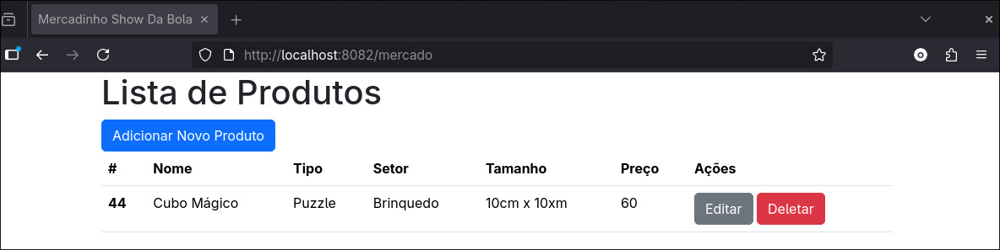

# Mercadinho Show da Bola – Parte 2 (Spring MVC)

Sistema web desenvolvido em **Java + Spring MVC** para gerenciar os produtos do Mercadinho Show da Bola.  
Nesta parte, foi implementada uma **interface web** utilizando **Thymeleaf**, permitindo realizar todas as operações de **CRUD (Create, Read, Update, Delete)** diretamente pelo navegador, com integração ao banco de dados Oracle.

---

## Integrantes

| Nome           |   RM   |
| :------------- | :----: | 
| Otavio Miklos  | 554513 |
| Luciayla Yumi  | 557987 |
| Tiago Ribeiro  | 558021 |
| Raphaela Tatto | 554983 |

---

## Sumário
- [Definição do projeto](#definição)
    - [Tecnologias](#tecnologias)
- [Rodando o sistema](#rodando-o-sistema)
- [Funcionalidades](#funcionalidades)
- [Prints da interface](#prints-da-interface)

---

## Definição

Projeto feito seguindo as boas práticas e requisições propostas:
- Uso de **Spring MVC** com **Thymeleaf**.
- Operações de **CRUD** completas pela interface web.
- Integração com banco **Oracle**.
- Deploy realizado em plataforma cloud.

---

## Tecnologias
- Java 17+
- Spring Boot (MVC)
- Maven
- Thymeleaf
- Lombok
- Banco de Dados: Oracle
- Spring Web, Spring Data JPA, Validation

---

## Rodando o sistema
```bash
# Clone o repositório
git clone https://github.com/usuario/cp4_java_mvc.git

# Entre no diretório
cd cp4_java_mvc

# Rode com o Maven
./mvnw spring-boot:run
```

Depois acesse no navegador:
```
http://localhost:8082
```

---

## Funcionalidades
- **Listagem de produtos** → Mostra todos os itens cadastrados no mercadinho.
- **Cadastro de produto (Create)** → Formulário para inserir um novo produto.
- **Consulta (Read)** → Visualização detalhada de um produto específico.
- **Edição (Update)** → Formulário para alterar os dados de um produto existente.
- **Exclusão (Delete)** → Botão para remover um produto do sistema.

---

## Prints da interface

- Tela inicial com listagem de produtos vazia
  

- Formulário de cadastro (Create)  
  

- Cadastrando produto
  

- Listagem de produtos com produto cadastrado
  

- Página de edição (Update)
  

- Tamanho alterado
  

- Listagem de produtos com "tamanho" atualizado
  

- Confirmação de exclusão (Delete)  
  

- Listagem de produtos atualizada
  


